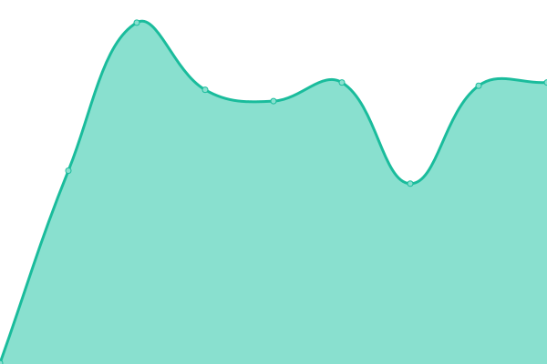

# [📈 Live Status](https://status.nikostechlabs.com): <!--live status--> **🟧 Partial outage**

This repository contains the open-source uptime monitor and status page for [neksodebe](https://nikostechlabs.com/), powered by [Upptime](https://github.com/upptime/upptime).

With [Upptime](https://upptime.js.org), you can get your own unlimited and free uptime monitor and status page, powered entirely by a GitHub repository. We use [Issues](https://github.com/neksodebe/ntl-upptime/issues) as incident reports, [Actions](https://github.com/neksodebe/ntl-upptime/actions) as uptime monitors, and [Pages](https://status.nikostechlabs.com) for the status page.

<!--start: status pages-->
<!-- This summary is generated by Upptime (https://github.com/upptime/upptime) -->
<!-- Do not edit this manually, your changes will be overwritten -->
<!-- prettier-ignore -->
| URL | Status | History | Response Time | Uptime |
| --- | ------ | ------- | ------------- | ------ |
|  [Niko's TechLabs Website](https://nikostechlabs.com/) | 🟩 Up | [niko-s-tech-labs-website.yml](https://github.com/neksodebe/ntl-upptime/commits/HEAD/history/niko-s-tech-labs-website.yml) | 

 1097ms
     
 | 

<a href="https://status.nikostechlabs.com/history/niko-s-tech-labs-website">100.00%</a>
    

|  [Route Roulette](http://routeroulette.xyz/) | 🟥 Down | [route-roulette.yml](https://github.com/neksodebe/ntl-upptime/commits/HEAD/history/route-roulette.yml) | 

 0ms
     
 | 

<a href="https://status.nikostechlabs.com/history/route-roulette">94.42%</a>
    

|  [Parottu - Landing page](https://parottu.com/) | 🟩 Up | [parottu-landing-page.yml](https://github.com/neksodebe/ntl-upptime/commits/HEAD/history/parottu-landing-page.yml) | 

 277ms
     
 | 

<a href="https://status.nikostechlabs.com/history/parottu-landing-page">100.00%</a>
    

<!--end: status pages-->

[**Visit our status website →**](https://status.nikostechlabs.com)

## 📄 License

- Powered by: [Upptime](https://github.com/upptime/upptime)
- Code: [MIT](./LICENSE) © [Anand Chowdhary](https://anandchowdhary.com), supported by [Pabio](https://pabio.com)
- Data in the `./history` directory: [Open Database License](https://opendatacommons.org/licenses/odbl/1-0/)
